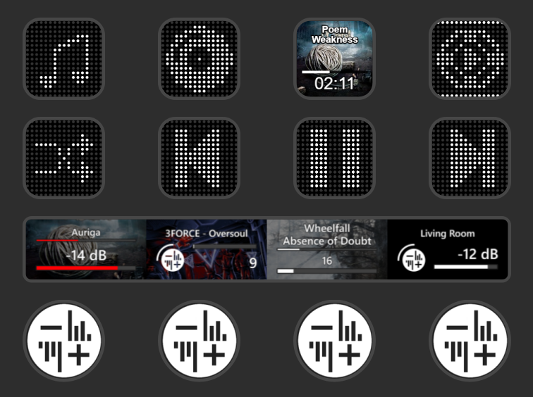
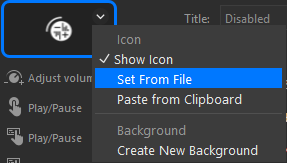

# Roon: Dialed Up

A Stream Deck plugin for controlling [Roon](https://roon.app) playback, built on top of the Stream Deck+'s dials, touchscreen and buttons.

Install it from the [Elgato Marketplace](https://marketplace.elgato.com/product/roon-dialed-up-f76699d9-4266-4d4a-ad94-eaddd148daa9).

This started as a fork of Tomi Blinnikka's [streamdeck-roon](https://github.com/docBliny/streamdeck-roon). None of this would exist without his foundational work, made possible because he open-sourced the project and opened it up for anyone to build on. The codebase has changed substantially since then (new icon system, touchscreen customization, dial support, and more), but the foundation and the original idea are his. Licensed MIT, same as the original; see [LICENSE](LICENSE).



## Features

### Buttons

- Play / Pause (album art, artist/track, elapsed time, and progress bar, each independently toggleable)
- Play
- Pause
- Stop
- Play This / Play Item
- Previous
- Next
- Loop All / Loop One (independent toggles)
- Shuffle mode (on / off)
- Volume up
- Volume down
- Volume set
- Mute / Unmute
- Roon Radio on/off
- Connection Status (a light that shows whether the plugin is connected to your Core, with an optional Core name underneath)
- Launch App and Search (open [Roon: Toasted](https://github.com/Vulkandr/roon-toasted), my companion app)

### Dials (Stream Deck+)

- Adjust Volume: rotate to change volume, short press to mute/unmute (or play/pause, if set to that mode), long press to mute/unmute all zones
- Player Controls: play/pause on press, previous/next on rotation, hold-to-mute on the touchscreen, with a Show Volume toggle to switch its touchscreen layout between a centered display and one that includes the volume readout

### Customization

- Three icon styles: LED Grid, LED, and Classic, with a full color picker for the LED styles
- Two text fonts, chosen per key or dial: Classic (the original Arial-style look) and Condensed (narrower, fits more text per line)
- Touchscreen title display: off, output name, or artist and song
- Touchscreen progress bar: off, replacing the volume bar, or as its own row
- Optional logo, hiding it frees up horizontal space for the rest of the layout
- UI and album art transparency sliders
- Independent text and bar color pickers

## Using the Roon logo

The Roon logo isn't bundled with the plugin, to avoid shipping any copyrighted assets. If you'd like it as your icon, save your own copy of the logo, then in the Stream Deck software click the small dropdown arrow on the corner of the action's icon and choose **Set From File** to select it.



## Installation

Requires Stream Deck software 7.1 or later. The button actions work on any Stream Deck; the two Dial actions need a Stream Deck+.

**Elgato Marketplace:** [Roon: Dialed Up](https://marketplace.elgato.com/product/roon-dialed-up-f76699d9-4266-4d4a-ad94-eaddd148daa9). This is the easiest way to install it and keep it updated.

**Manual:** build from source and package it (see "Build a release package" below), then double-click the resulting `.streamDeckPlugin` file to install it.

## Configuration

Add one of the Roon actions to your Deck. The plugin finds your Roon Core on its own; when it does, the **Roon Core** section at the top of the settings shows a green light and the Core's name.

Open Roon, go to **Settings → Extensions**, find **Roon: Dialed Up**, and click **Enable**. This is a one-time step per Core.

Then open the **Output** section and pick the output (zone) the button should control. Each button remembers its own output.

**If your Core isn't found for whatever reason**, click **Manual** next to the Core name, enter the Core's IP address (or hostname) and port (usually `9330`), and click **Connect**. The address is remembered. The **Available Cores** list lets you switch between Cores you have enabled.

**Roon: Toasted buttons.** The Launch App and Search actions open [Roon: Toasted](https://github.com/Vulkandr/roon-toasted) (my companion app) and do nothing if it isn't installed. Their settings show whether Toasted is running, with a Launch button when it isn't. Windows only.

## Upgrading from 1.x

Your existing buttons and your Roon authorization carry over, so there is nothing to re-enable in Roon. The old host and port fields are gone in favor of automatic discovery, with a Manual button as a fallback.

## Local development

### Source code

The plugin is TypeScript on the Stream Deck SDK v3 (Node.js). Source is in `src/`; the settings panel is `com.vulkan.roon-dialed-up.sdPlugin/ui/roon.html`.

```
npm install
npm run build
```

`npm run build` bundles the plugin into `com.vulkan.roon-dialed-up.sdPlugin/bin` and copies the Roon libraries it needs into that folder's `node_modules`. To try it in Stream Deck, see "Run without installing" below, or "Build a release package" to make an installer.

### Run without installing

Install Elgato's [Stream Deck CLI](https://docs.elgato.com/streamdeck/cli/intro), then link the built folder into Stream Deck and rebuild on change:

```
npm install -g @elgato/cli
streamdeck link com.vulkan.roon-dialed-up.sdPlugin
npm run watch
```

Stream Deck locks a plugin's files while it is running, so quit the app before replacing the folder by hand.

### Build a release package

- Bump `version` in `package.json` and `Version` in `manifest.json` (`major.minor.patch.build`, for example `2.0.0.0`).
- `npm run build`
- `streamdeck validate com.vulkan.roon-dialed-up.sdPlugin`
- `streamdeck pack com.vulkan.roon-dialed-up.sdPlugin`

### Fonts

Text on keys and the touchscreen is drawn as vector outlines from the fonts in `com.vulkan.roon-dialed-up.sdPlugin/fonts/` (Liberation Sans and Fira Sans Condensed, both under the SIL Open Font License; see `OFL.txt` there). Liberation Sans is metrically identical to Arial, which the original plugin used.

## Misc

Roon is a trademark or registered trademark of Roon Labs LLC.

Elgato, Corsair, and Stream Deck are trademarks or registered trademarks of Corsair GmbH.
